# Ralph Workflow

Autonomous AI development using fresh context windows. Run complex multi-step projects unattended with human gates for quality control.

Based on the [Ralph technique by Geoffrey Huntley](https://ghuntley.com/ralph/). All scripts and skills in this repo were built in-house.

## TL;DR

Ralph is a bash loop that spawns fresh Claude instances for each iteration. Memory persists in files (prd.json, git), not in Claude's context window. This lets you tackle projects larger than a single context window.

**Key Features:**
- 🔄 **Auto-tmux** - Sessions survive laptop lid close/disconnect
- ⌨️ **Smart Ctrl+C** - Single press skips iteration, double press exits
- 📊 **Live status** - `ralph-status.txt` shows current story and progress
- 📝 **Session logging** - Full output captured to `ralph-session-*.log`
- 🔓 **No permission blocks** - Uses `bypassPermissions` mode
- 🧪 **TDD-first** - Test specs defined at PRD time, enforced during implementation
- 📚 **Documentation tracking** - Docs are acceptance criteria, not afterthoughts

## Workflow Overview

```mermaid
flowchart TD
    subgraph PLAN ["📋 PLAN"]
        A["/wiggum-prd<br/>Create PRD with stories"]
        B["5-Persona Review<br/>Dev, QA, Security, UX, Docs"]
    end

    subgraph GATE1 ["🚦 HUMAN GATE"]
        C{{"Approve PRD?"}}
    end

    subgraph BUILD ["🔨 BUILD"]
        D["ralph.sh prd.json 50<br/>TDD Implementation Loop"]
        E["Each iteration:<br/>RED → GREEN → REFACTOR"]
    end

    subgraph GATE2 ["🚦 HUMAN GATE"]
        F{{"Sanity Check?"}}
    end

    subgraph REVIEW ["🔍 REVIEW"]
        G["/wiggum-review<br/>6-Persona Code Review"]
    end

    subgraph GATE3 ["🚦 HUMAN GATE"]
        H{{"Approve & Merge?"}}
    end

    subgraph SHIP ["🚀 SHIP"]
        I["/wiggum-release<br/>Record Release"]
    end

    A --> B --> C
    C -->|Yes| D
    C -->|Edit| A
    D --> E --> F
    F -->|Yes| G
    F -->|Issues| D
    G --> H
    H -->|Yes| I
    H -->|Issues| D

    style PLAN fill:#1e3a5f,stroke:#3b82f6,color:#fff
    style BUILD fill:#1e3a5f,stroke:#22c55e,color:#fff
    style REVIEW fill:#1e3a5f,stroke:#a855f7,color:#fff
    style SHIP fill:#1e3a5f,stroke:#f59e0b,color:#fff
    style GATE1 fill:#0f172a,stroke:#ef4444,color:#fff
    style GATE2 fill:#0f172a,stroke:#ef4444,color:#fff
    style GATE3 fill:#0f172a,stroke:#ef4444,color:#fff
```



**Key insight:** Fresh context per iteration during BUILD, accumulated context during PLAN and REVIEW.

## Why This Approach?

### The Problem
- Claude's context window is finite - complex projects exceed it
- Accumulated context leads to confusion and degraded performance
- Long sessions lose focus on what matters
- AI often skips tests and documentation (the "shadow system")

### The Solution: Fresh Context Per Iteration
| Aspect | Traditional | Ralph Workflow |
|--------|-------------|----------------|
| Context | Accumulates until overflow | Fresh each iteration |
| Memory | In Claude's context | In files (prd.json, git) |
| Scale | Limited by context window | Unlimited iterations |
| Focus | Degrades over time | Sharp every iteration |
| Testing | Often skipped | TDD enforced via test specs |
| Documentation | Afterthought | Tracked as acceptance criteria |

### Key Advantages

**1. Unlimited Project Scale**
- Run 50+ iterations without context overflow
- Each iteration reads full state from files
- Projects that would be impossible in one session become routine

**2. Unattended Execution**
- Start `ralph.sh` and walk away
- Run overnight for large features
- Check progress via `ralph.log` and git commits

**3. Quality Through Human Gates**
- 4 checkpoints prevent building the wrong thing
- PRD review catches issues before implementation
- Code review ensures production quality

**4. Multi-Persona Review**
- 5 personas review PRD (Developer, QA, Security, User Advocate, Documentation)
- 6 personas review code (Code, Security, Architecture, Frontend, QA, PM)
- Different perspectives catch different issues

**5. TDD-First Development**
- Test specs defined at PRD time, before any code exists
- Ralph implements tests FIRST, watches them fail, then writes code
- No production code without a failing test

**6. Documentation as First-Class Citizen**
- Each story specifies what documentation it needs
- ARCHITECTURE.md scaffolding for AI agent context
- Docs are acceptance criteria - story fails without them

**7. Partial Release Support**
- Client needs something early? Release completed stories
- Manifest tracks what shipped and what's pending
- Continue implementation after partial release

**8. Easy Multi-Machine Setup**
- Clone repo, run install script, add to PATH
- Symlinked skills update with `git pull`
- Same workflow on laptop, desktop, CI

## Installation

### 1. Clone the Repo

```bash
git clone https://github.com/newoldrelic/ralph-workflow.git ~/Documents/GitHub/ralph-workflow
```

### 2. Install Skills

The install script creates symlinks so skills stay in sync with repo updates:

```bash
~/Documents/GitHub/ralph-workflow/install-skills.sh
```

### 3. Add Scripts to PATH

Add to `~/.zshrc` or `~/.bashrc`:

```bash
export PATH="$PATH:$HOME/Documents/GitHub/ralph-workflow"
```

Then reload:
```bash
source ~/.zshrc
```

### 4. Prerequisites

- Claude CLI: `npm install -g @anthropic-ai/claude-code`
- Node.js (for manifest JSON manipulation)
- tmux (for session persistence): `brew install tmux` on macOS
- Optional: `unbuffer` for better live output: `brew install expect` on macOS

## Quick Start

```bash
# 1. Create a PRD (with story-by-story review, test specs, docs requirements)
/prd "Your feature description"

# 2. Initialize for Ralph (5-persona review, prd.json, git branch, docs scaffold)
/wiggum-prd existing

# 3. Exit and run TDD implementation in a separate terminal
ralph.sh prd.json 50

# 4. When complete, run code review
/wiggum-review
# Or for large projects:
ralph-code-review.sh prd.json 25

# View status of all features
/wiggum-status
```

## The Complete Workflow

```
/prd "feature description"
    ↓
[Single Context - Skill]
├── Asks clarifying questions (including testing & docs)
├── Generates PRD with user stories
├── Each story has: acceptance criteria, TEST SPEC, docs required
├── Reviews each story with you (approve/edit/remove)
├── Saves to tasks/prd-[feature].md
└── Says "Run /wiggum-prd existing"
    ↓
/wiggum-prd existing
    ↓
[Single Context - Skill]
├── Runs PRD review (5 personas in-context)
│   └── NEW: Documentation Reviewer checks docs requirements
├── Gets human approval
├── Converts to prd.json (with testSpec and docsRequired)
├── Offers ARCHITECTURE.md scaffolding for new projects
├── Inits git branch, progress.txt, manifest
└── Says "Exit and run ralph.sh prd.json"
    ↓
ralph.sh prd.json 50  (separate terminal - TDD per iteration)
    ↓
Each iteration:
├── Reads test spec from prd.json
├── Writes test FIRST (RED)
├── Implements minimal code (GREEN)
├── Updates docs if docsRequired is set
└── Commits and exits
    ↓
/wiggum-review or ralph-code-review.sh prd.json
    ↓
Human final approval → Merge
    ↓
/wiggum-release prd.json  (record the release)
```

## Skills (Chief Wiggum oversees Ralph!)

| Skill | Description |
|-------|-------------|
| `/prd` | Generate a PRD with test specs and docs requirements |
| `/wiggum-prd` | Initialize feature: 5-persona review, prd.json setup, docs scaffold, git branch |
| `/wiggum-review` | In-context 6-persona code review (for projects <20 stories) |
| `/wiggum-status` | Show status of all tracked features |
| `/wiggum-release` | Record partial or full release |

## Scripts

All scripts take explicit file arguments for clarity:

| Script | Usage | Purpose |
|--------|-------|---------|
| `ralph.sh` | `ralph.sh <prd.json> [iterations]` | TDD implementation loop (fresh context) |
| `ralph-prd-review.sh` | `ralph-prd-review.sh <prd.md> [iterations]` | PRD review with 4 personas |
| `ralph-code-review.sh` | `ralph-code-review.sh <prd.json> [iterations]` | Code review with 6 personas |
| `ralph-status.sh` | `ralph-status.sh [manifest]` | Show all feature statuses |
| `ralph-release.sh` | `ralph-release.sh <prd.json> [commit] [notes]` | Record partial/full release |
| `ralph-manifest-add.sh` | `ralph-manifest-add.sh <name> <prd> <branch> [status]` | Add feature to manifest |

### ralph.sh - TDD Implementation Loop

Each iteration:
1. Reads `prd.json` and `progress.txt` for full context
2. Shows available stories (with dependency tracking)
3. **Reads test spec for the story**
4. **Writes tests FIRST (RED)**
5. **Implements minimal code to pass (GREEN)**
6. **Updates documentation if docsRequired is set**
7. Updates prd.json, commits
8. Exits (script loops with fresh context)

On completion, auto-suggests review type based on story count.

```bash
ralph.sh prd.json 50  # max 50 iterations
```

**Automatic tmux wrapping:**
- Script automatically starts in a tmux session
- Session survives laptop lid close, SSH disconnect, etc.
- To detach: `Ctrl+B` then `D`
- To reattach: `tmux attach -t ralph-<project-name>`
- Disable with: `RALPH_NO_TMUX=1 ralph.sh prd.json`

**Ctrl+C handling:**
- Single `Ctrl+C`: Skips current iteration, continues to next
- Double `Ctrl+C` (within 2 seconds): Exits Ralph completely

**Generated files:**
- `ralph-status.txt` - Current iteration, story, and status (for quick checks)
- `ralph-session-YYYYMMDD-HHMMSS.log` - Full session output
- `ralph.log` - Compact iteration log

### ralph-prd-review.sh - PRD Review

5 personas review PRD requirements:
- **DEVELOPER** - Technical feasibility, story scoping, test spec realism
- **QA_ENGINEER** - Testability, verifiable criteria, test spec completeness
- **SECURITY_ENGINEER** - Security implications, OWASP, security test coverage
- **USER_ADVOCATE** - User perspective, UX
- **DOCUMENTATION_REVIEWER** - Docs requirements, AI context needs

```bash
ralph-prd-review.sh tasks/prd-my-feature.md 12
```

### ralph-code-review.sh - Code Review

6 personas polish code, leveraging existing skills:
- **CODE_REVIEWER** - Uses `/requesting-code-review`, `/systematic-debugging`
- **SECURITY_ENGINEER** - OWASP Top 10 guide
- **SYSTEM_ARCHITECT** - Structure, separation of concerns
- **FRONTEND_DESIGNER** - Uses `/frontend-design`
- **QA_ENGINEER** - Uses `/test-driven-development`
- **PROJECT_MANAGER** - Uses `/verification-before-completion`

Must pass 2 full cycles (12 consecutive clean iterations).

```bash
ralph-code-review.sh prd.json 25
```

### ralph-status.sh - Feature Status

View all features being tracked:

```bash
ralph-status.sh

# Output:
# 📊 Ralph Feature Status
# Project: My Project
#
# ✅ User Authentication - complete
# 📦 Product Catalog - partial_release
# 🔧 Payment Integration - in_progress
# 📋 Email Notifications - planned
```

### ralph-release.sh - Record Releases

Record when stories are released, even if the feature isn't complete (partial release):

```bash
# Full release (all stories complete)
ralph-release.sh prd.json

# Partial release with notes
ralph-release.sh prd.json abc123 "Released auth stories for client demo"
```

## Skills vs Scripts

| Tool | Context | Best For |
|------|---------|----------|
| `/wiggum-prd` | Single (accumulated) | Init phase - PRD creation, review, setup |
| `ralph.sh` | Fresh per iteration | Implementation - could be 50+ iterations |
| `/wiggum-review` | Single (accumulated) | Code review for smaller projects (<20 stories) |
| `ralph-code-review.sh` | Fresh per iteration | Code review for larger projects |

**Why the split?**
- Init benefits from accumulated context (each persona sees what others found)
- Implementation needs fresh context (could exceed context window)
- Code review depends on project size

## TDD Integration

Ralph enforces test-driven development through test specs defined at PRD time:

### Test Spec in PRD
```markdown
### US-002: Display priority indicator
**Test Spec:**
- [ ] Test: TaskCard renders PriorityBadge with correct color for 'high'
- [ ] Test: TaskCard renders PriorityBadge with correct color for 'medium'
- [ ] Test: PriorityBadge displays correct icon for each level
- [ ] Edge case: Missing priority defaults to 'medium'
```

### Test Spec in prd.json
```json
{
  "id": "US-002",
  "title": "Display priority indicator",
  "testSpec": [
    "Test: TaskCard renders PriorityBadge with correct color for 'high'",
    "Test: TaskCard renders PriorityBadge with correct color for 'medium'",
    "Test: PriorityBadge displays correct icon for each level",
    "Edge case: Missing priority defaults to 'medium'"
  ],
  "docsRequired": "Update COMPONENTS.md with PriorityBadge"
}
```

### TDD Enforcement
During implementation, Ralph:
1. Reads test spec from prd.json
2. Writes test FIRST
3. Runs test - verifies it FAILS (RED)
4. Writes minimal code to pass
5. Runs test - verifies it PASSES (GREEN)
6. Refactors if needed (stay GREEN)

## Documentation Integration

Documentation is tracked as acceptance criteria, not an afterthought:

### Docs Required Field
Each story specifies what documentation it needs:
- `None` - No documentation needed
- `Update ARCHITECTURE.md` - New pattern introduced
- `Update API.md` - API changes
- `Update COMPONENTS.md` - New component pattern

### ARCHITECTURE.md Scaffolding
For new projects, `/wiggum-prd` offers to create an ARCHITECTURE.md scaffold:

```markdown
# Architecture Overview

## Tech Stack
- [Framework/language]
- [Database]
- [Key libraries]

## Key Patterns
- [Pattern 1]: [description]

## For AI Agents
When starting a new session, read this file first to understand:
1. The tech stack and project structure
2. Key patterns used in this codebase
```

This helps fresh Claude instances understand the codebase quickly.

## Required Files

| File | Purpose |
|------|---------|
| `tasks/prd-*.md` | PRD file with test specs and docs requirements |
| `prd.json` | Structured tasks with testSpec and docsRequired |
| `progress.txt` | Learning log across iterations |
| `ralph-manifest.json` | Tracks all features |
| `prd-review.md` | PRD review feedback (generated) |
| `ARCHITECTURE.md` | Codebase overview for AI context (optional) |
| `ralph-status.txt` | Current Ralph status (generated) |
| `ralph-session-*.log` | Full session output (generated) |
| `ralph.log` | Compact iteration log (generated) |

### prd.json Structure

```json
{
  "project": "Project Name",
  "branchName": "feature/branch-name",
  "description": "Feature description",
  "userStories": [
    {
      "id": "US-001",
      "title": "Story title",
      "description": "As a [user], I want...",
      "acceptanceCriteria": ["criterion 1", "criterion 2"],
      "testSpec": [
        "Test: description of test case",
        "Edge case: edge case description"
      ],
      "docsRequired": "None | ARCHITECTURE.md | API.md | etc.",
      "priority": 1,
      "dependsOn": [],
      "passes": false,
      "notes": ""
    }
  ]
}
```

## Human Gates

| Gate | Where | What You Review |
|------|-------|-----------------|
| **Gate 1** | In `/wiggum-prd` | PRD captures what you want? |
| **Gate 2** | In `/wiggum-prd` | Persona feedback acceptable? (including docs review) |
| **Gate 3** | After `ralph.sh` | Implementation sanity check |
| **Gate 4** | After review | Final approval, merge |

## Monitoring

While Ralph runs:

```bash
# Quick status check
cat ralph-status.txt

# Watch live output (from another terminal)
tail -f ralph-session-*.log

# Watch progress log
tail -f ralph.log

# Watch commits
watch -n 5 'git log --oneline -10'

# Check story completion
cat prd.json | jq '.userStories[] | select(.passes == true) | .id'

# View all features
/wiggum-status

# Reattach to tmux session (if disconnected)
tmux attach -t ralph-<project-name>
```

## Troubleshooting

### MCP Server Errors
If you see errors like `MCP server github invalid: Missing environment variables`:

```bash
# Option 1: Set required environment variables
export GITHUB_PERSONAL_ACCESS_TOKEN="your-token"
export GREPTILE_API_KEY="your-key"

# Option 2: Use minimal Claude config for Ralph
# Create ~/.claude/ralph-config.json with minimal MCP servers
```

Ralph's Claude instance inherits your environment and Claude configuration. If you have MCP plugins configured that require API keys, ensure those keys are available in the shell where you run ralph.sh.

### No Live Output
If you don't see any output:
1. Check if tmux session is running: `tmux list-sessions`
2. Reattach to session: `tmux attach -t ralph-<project-name>`
3. Check session log: `tail -f ralph-session-*.log`
4. Check for errors in log file

### Claude Hangs or Takes Forever
Common causes:
- MCP plugins failing to initialize (see above)
- Permission blocks (should not happen with `bypassPermissions` mode)
- Network issues reaching Claude API

Check the session log for error messages:
```bash
tail -100 ralph-session-*.log | grep -i error
```

### Permission Blocks
Ralph uses `--permission-mode bypassPermissions` which should allow all operations. If you still see permission issues, ensure you're using the latest version of ralph.sh.

## When to Use Ralph

**Good for:**
- Features with 5+ distinct implementation steps
- Work you want to run unattended (overnight)
- Greenfield projects with clear requirements
- Tasks with automatic verification (tests, typecheck)
- Projects that need good documentation for AI agents

**Not good for:**
- Quick fixes (1-2 file changes)
- Exploratory work without clear requirements
- Tasks requiring frequent human judgment

## Credits

**Inspiration:** The Ralph technique concept by [Geoffrey Huntley](https://ghuntley.com/ralph/)

**Built in-house:** All scripts and Wiggum skills in this repo
